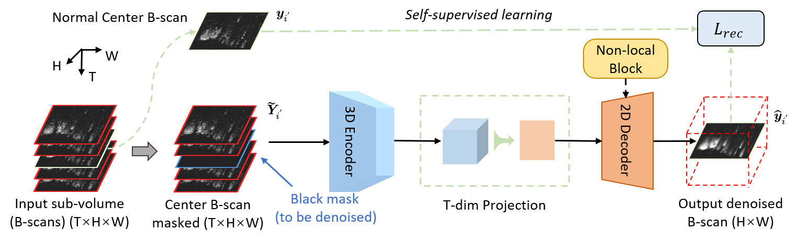
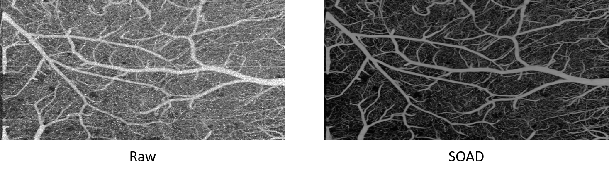

# SOAD

This repo contains the offical PyTroch code for **Self-supervised Denoising and Bulk Motion Artifact Removal of 3D Optical Coherence Tomography Angiography of Awake Brain** @ MICCAI 2024 [paper link](https://papers.miccai.org/miccai-2024/paper/0736_paper.pdf)

## Overview


## Result


## Data Preparation

Checkpoint, example data and ROI labels are available at [data link](https://drive.google.com/drive/folders/1DhTWe1PzyWxY3p6A0ZCokx7ilZk2UTm5?usp=sharing). 

For preparation, simply put the shared data folder and the checkpoint file under the root of this repo.

To train or test on custom datasets, put the volumes under `data/OCTA/[custom volume folders]` and (optional) put the indices (split by spaces) of the estimated corrupted B-scans in `data/OCTA/[volume folder name]_BMA_index.txt`.

## Instructions

Run `octa_train.py` and `octa_test.py` for training and testing (inference). 

Run `octa_test.py --padding` to keep the boundary B-scans after inference by padding the input volumes.

Run `cnr_msr_normal.py` and `cnr_msr_corrupted.py` to calculate CNR and MSR based on the ROI labels and visualize the scores as well as the ROI bounding boxes.

## Acknowledgments

This repo mainly refers to [Magic-VNet](https://github.com/Hsuxu/Magic-VNet) for the network architecture and [UDVD](https://github.com/sreyas-mohan/udvd) for the training scripts.

## Citation

```
@inproceedings{li2024self,
  title={Self-supervised Denoising and Bulk Motion Artifact Removal of 3D Optical Coherence Tomography Angiography of Awake Brain},
  author={Li, Zhenghong and Ren, Jiaxiang and Zou, Zhilin and Garigapati, Kalyan and Du, Congwu and Pan, Yingtian and Ling, Haibin},
  booktitle={International Conference on Medical Image Computing and Computer-Assisted Intervention},
  pages={601--611},
  year={2024},
  organization={Springer}
}
```