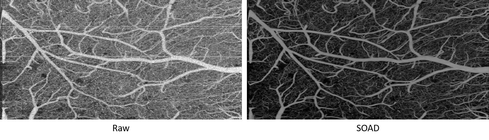

# SOAD

This repo contains the offical PyTroch code for **Self-supervised Denoising and Bulk Motion Artifact Removal of 3D Optical Coherence Tomography Angiography of Awake Brain** @ MICCAI 2024

## Overview

## Result

## Instructions

Checkpoint, example data and ROI labels are available at [data link](https://drive.google.com/drive/folders/1DhTWe1PzyWxY3p6A0ZCokx7ilZk2UTm5?usp=sharing) 

`octa_train.py` and `octa_test.py` are for training and testing (inference).

`cnr_msr_normal.py` and `cnr_msr_corrupted.py` are used to calculate CNR and MSR based on the ROI labels and visualize the scores as well as the ROI bounding boxes.

## Acknowledgments

This repo mainly refers to [UDVD](https://github.com/sreyas-mohan/udvd) and [Magic-VNet](https://github.com/Hsuxu/Magic-VNet) for the training scripts and network architecture.